# ЕППБ MVP — Единый портал поддержки бизнеса

Публичное MVP для конкурса АО «НИХ «Байтерек» / Astana Hub (дедлайн подачи 12.07.2026,
Demo Day 16.07.2026). Портал демонстрирует единый клиентский путь получения мер
поддержки и no-code/AI-конструктор новых государственных услуг: любая услуга — это
версионируемый JSON `Service Definition`, а не отдельная разработка формы.

## Живой стенд

- Клиентский путь: **https://bizdnai.com/baiterek/take**
- Административный путь (конструктор, AI-генератор, реестр услуг, заявки): **https://bizdnai.com/baiterek/create**

Голый `https://bizdnai.com/baiterek` редиректит на `/baiterek/take`. Отдельного
demo-mode нет — жюри работает с тем же стендом, что и реальные пользователи;
недоступные госинтеграции честно помечены как mock-коннекторы (см. §8 SPEC.md).

## Быстрый старт (3 команды)

```bash
cp .env.example .env
make up
make seed
```

`make up` поднимает docker-compose стек (api, web, postgres, nginx), `make seed`
прогоняет миграции и создаёт справочники + обе контрольные услуги **через тот же
публичный API конструктора**, которым пользуется администратор (не прямыми INSERT —
см. `backend/app/seed/control_cases.py`). После этого сайт доступен на
`http://localhost:8080/baiterek/take` и `http://localhost:8080/baiterek/create`.

Проверка окружения:

```bash
make ps            # docker compose ps
make test          # pytest (backend) + npm test (frontend)
make lint           # ruff, mypy, eslint, tsc
make lint-hardcode  # гейт дисквал-условия — см. ниже
```

## Критерий ТЗ → где смотреть

| Критерий ТЗ | Баллы | Где смотреть |
|---|---|---|
| 9.1 Соответствие задаче (2 контрольные услуги, клиент+админ, многоэтапность) | 15 | `docs/control-cases.md`, `backend/app/seed/control_cases.py`, `/take`, `/create/definitions` |
| 9.2 Конструктор: поля/расчёты/UX | 9 | `frontend/components/definitions/definition-editor-shell.tsx`, `backend/app/engine/rules.py`, `backend/app/engine/formulas.py` |
| 9.3 Архитектура + mock-интеграции + качество кода | 16 | `ARCHITECTURE.md`, `backend/app/integrations/`, `backend/app/engine/runtime.py`, `backend/tests/`, CI-гейт `make lint-hardcode` |
| 9.4 AI-компонент (клиент + админ) | 15 | `backend/app/ai/`, `frontend/app/create/generate`, `frontend/app/take/services/[slug]/page.tsx` (§7.1 — см. известный пробел ниже) |
| 9.5 Аналитическая отчётность | 3 | `frontend/components/analytics/analytics-catalog.tsx`, `frontend/app/take/analytics` |
| 9.6 Интерактивная карта проектов | 3 | `frontend/components/map/`, `frontend/app/take/map` |
| 9.7 Инструменты и материалы | 3 | `frontend/components/tools/`, `frontend/app/take/tools` |
| 9.8–9.10 Питч, UX/UI, презентация | 35 | `/take` целиком, `docs/IMPLEMENTATION_PLAN.md` §11 демо-сценарий, презентация PDF (артефакт заявки) |

## Как убедиться, что услуги не захардкожены

Обе контрольные услуги («Приобретение вагонов в лизинг» и «Агробизнес:
животноводство») существуют **только** как строки `service_definitions` в БД,
созданные конструктором/AI-генератором — не как код.

1. Grep-инвариант: в прикладном коде (вне сид-фикстур и документации) не должно
   встречаться «вагон», «животновод», `wagons`, `agroanimal`:

   ```bash
   make lint-hardcode
   ```

   Тот же самый grep выполняется в CI и обязан быть зелёным перед мержем.

2. Живое доказательство «данные, а не код»: откройте
   `https://bizdnai.com/baiterek/create`, найдите любую из двух контрольных услуг,
   зайдите в конструктор (`/create/definitions/{id}`), измените текст поля/подсказки
   или добавьте новое поле, нажмите «Опубликовать» — изменение сразу видно на
   `https://bizdnai.com/baiterek/take` без пересборки и деплоя.

## Известные пробелы MVP (честно, не скрываем)

- **AI-копайлоты клиента (SPEC §7.1).** «Объяснить простыми словами» на карточке
  услуги и «Проверка полноты заявки» перед отправкой — в UI как явные точки
  расширения (первая — видимая кнопка с меткой AI, пока задизейблена), но серверных
  эндпоинтов под них ещё нет (backend отдаёт только `/api/v1/intake/match` —
  AI-подбор меры на главной, он реализован и работает). Кнопки специально не
  прячутся и не выдаются за рабочие: как только эндпоинт появится — включаются в
  один PR без изменения контракта.
- **KZ-локализация** — заглушка-переключателя в интерфейсе нет вообще (не только
  недоделана, а физически отсутствует). Это осознанное решение по SPEC.md §12
  («порядок жертв при нехватке времени») и `docs/IMPLEMENTATION_PLAN.md` §1
  («вне MVP: … полный KZ-перевод»). Интерфейс работает только на русском.

## Скриншоты

Скриншоты живого стенда `https://bizdnai.com/baiterek` (Playwright, headless
Chromium). Полный набор для заявки (PDF/архив) — см. презентацию, обязательный
артефакт заявки (SPEC.md §13).

### Клиентский путь (`/take`) — desktop

| | |
|---|---|
| 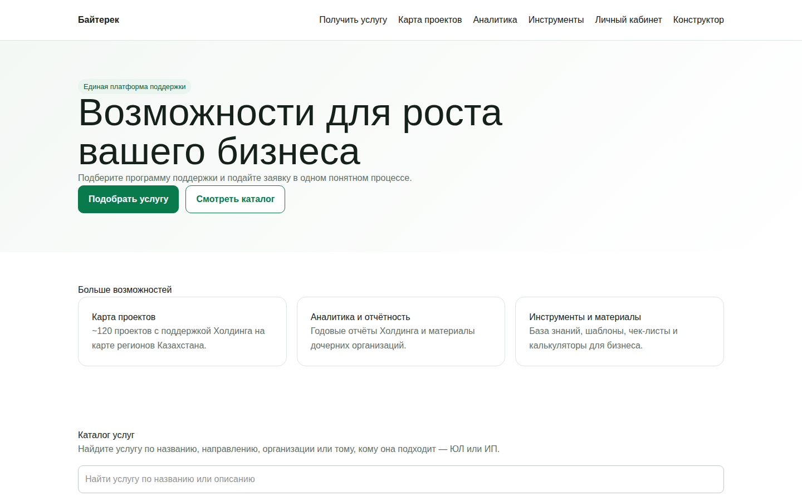 **Главная** — подбор меры поддержки, витрина услуг | 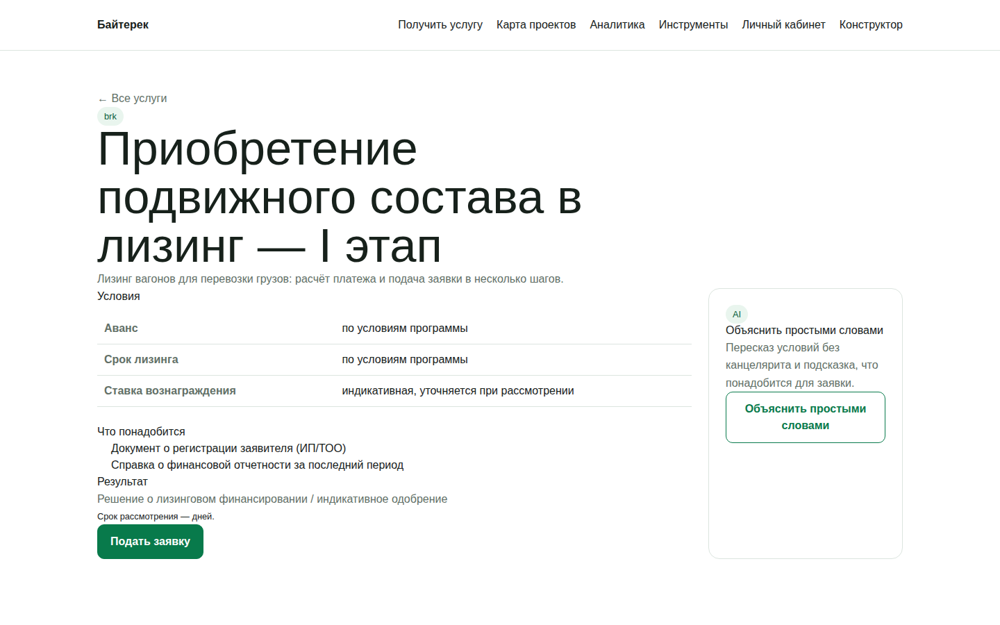 **Карточка услуги** — условия программы + блок AI «Объяснить простыми словами» |
| 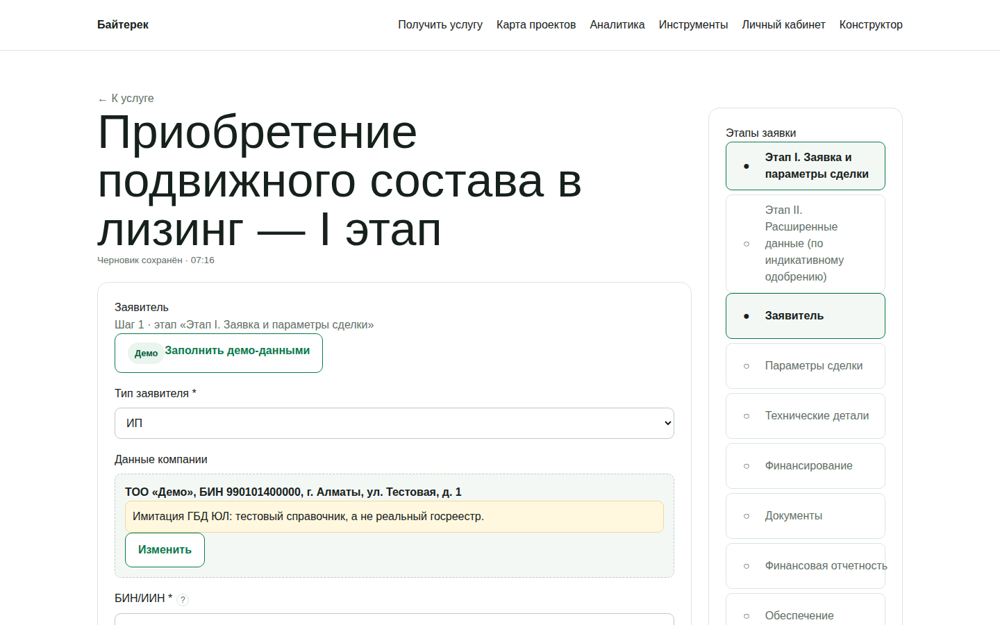 **Анкета заявки**, заполненная демо-данными (мастер-визард по этапам) | 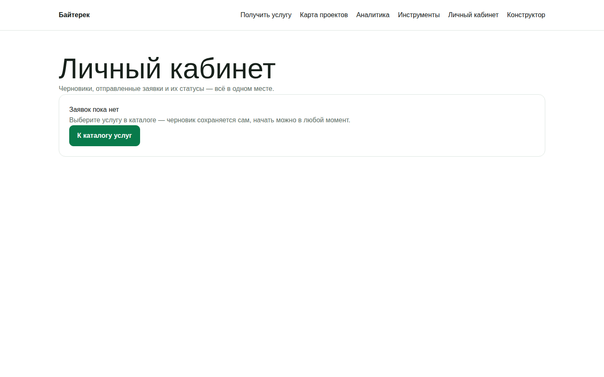 **Личный кабинет** — заявки заявителя |
| 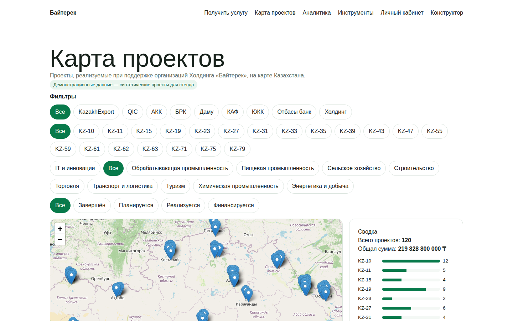 **Карта проектов** (Leaflet + OpenStreetMap) | 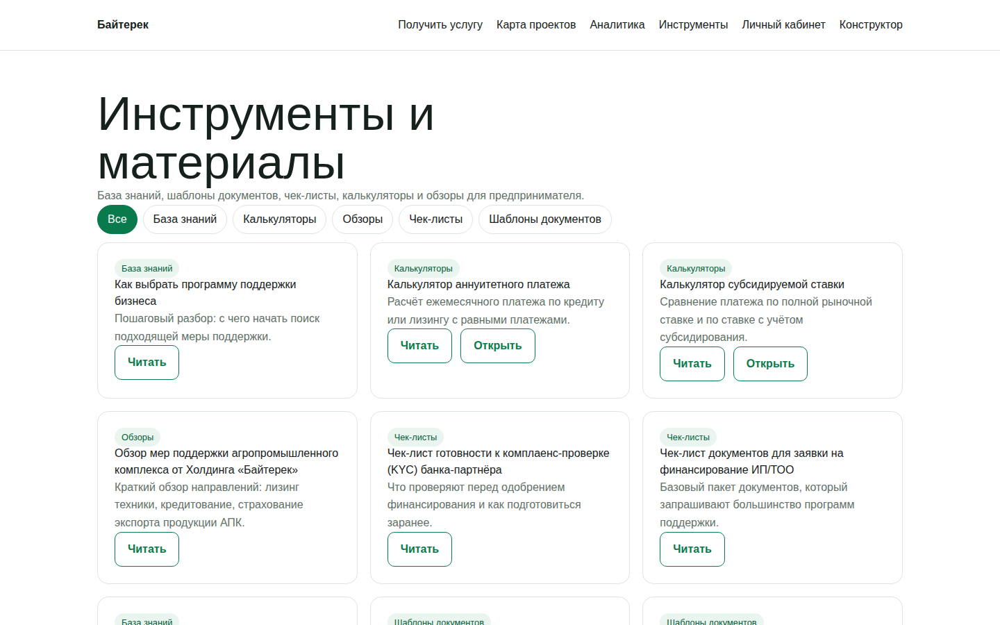 **Инструменты** — калькуляторы мер поддержки |

### Административный путь (`/create`) — desktop

| | |
|---|---|
| 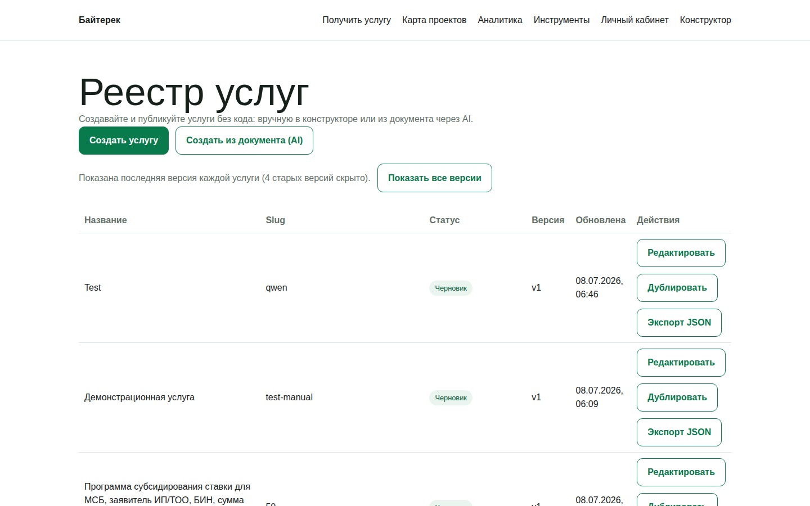 **Реестр услуг** — список Service Definition, версии, статусы | 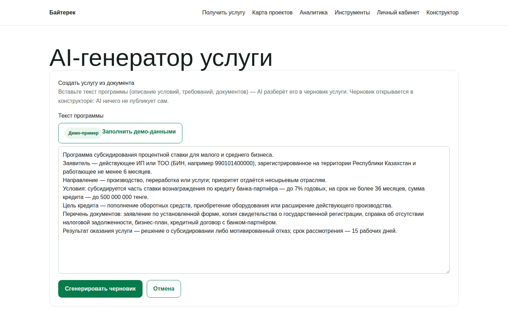 **AI-генератор** — создание услуги из документа, вставлен демо-текст |

### Мобильная версия (390×844)

| | | |
|---|---|---|
| 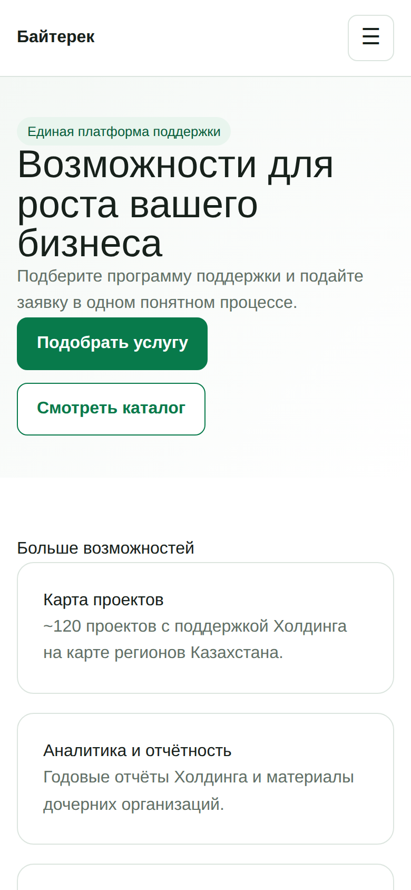 Главная | 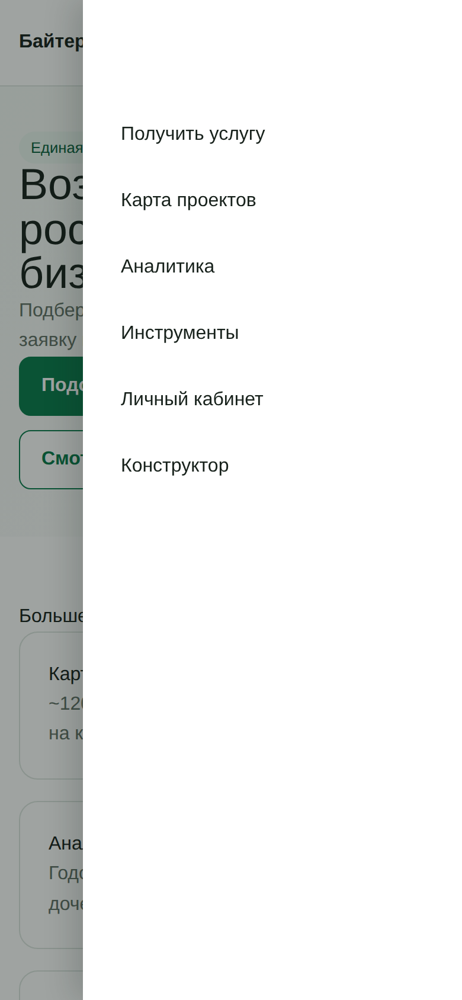 Выезжающее меню | 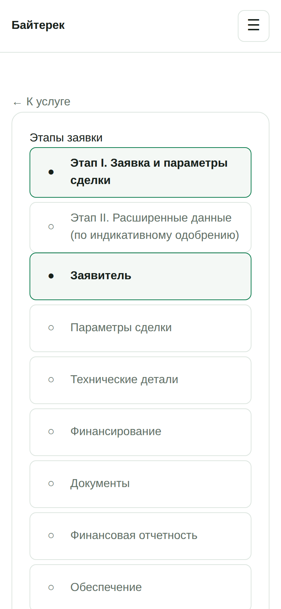 Анкета заявки |

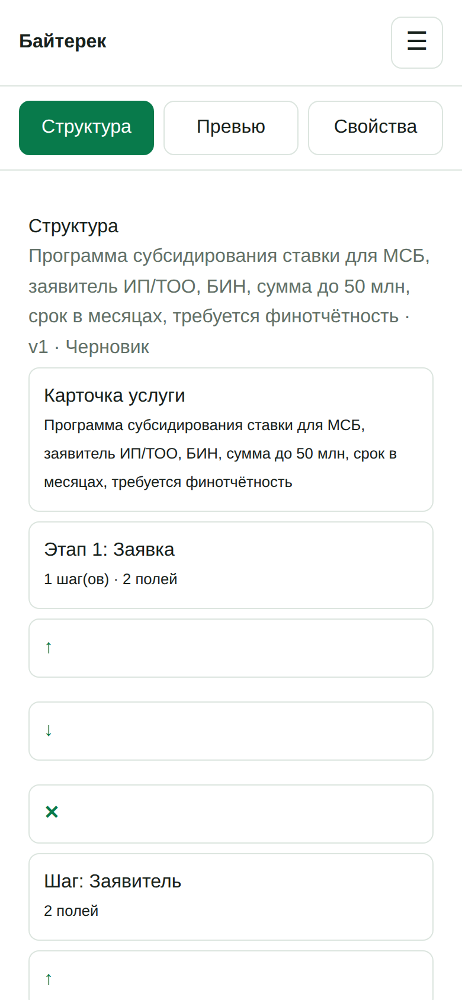

**Конструктор во вкладочном мобильном виде** (Структура / Превью / Свойства).

## Документы

- [Итоговая спецификация](SPEC.md)
- [Архитектура](ARCHITECTURE.md)
- [Пошаговый план реализации](docs/IMPLEMENTATION_PLAN.md)
- [Контрольные кейсы (источники условий услуг)](docs/control-cases.md)
- [Реестр подтверждения условий программ](docs/verify-register.md)
- [Матрица трассировки требование → тест → сценарий](docs/traceability.md)

## Стек

- **Backend:** Python 3.12, FastAPI, SQLAlchemy 2 (async), PostgreSQL 16 (JSONB), Alembic, Pydantic v2.
- **Frontend:** Next.js 14 (App Router), TypeScript, Tailwind CSS.
- **Карта:** Leaflet + OpenStreetMap.
- **AI:** `LLMProvider` интерфейс → `AnthropicProvider` / `MockLLMProvider` (ENV `LLM_PROVIDER`).
- **Инфраструктура:** docker-compose (api, web, postgres, nginx), Makefile, `.env.example`.

## Git

Рабочая ветка MVP и всех последующих push — `main`.

## Команда

BizDNAi.com · ceo@bizdnai.com · +7 707 333 34 81
